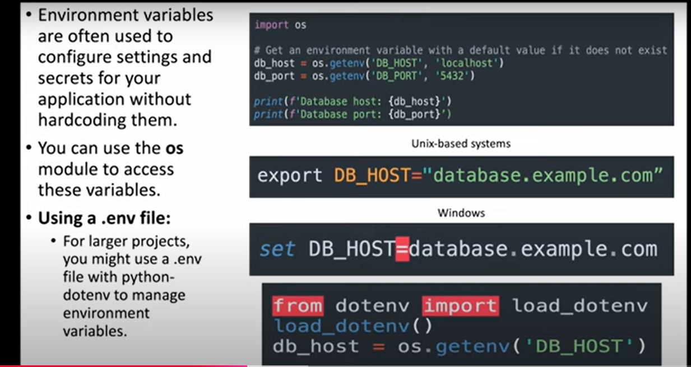

# PYTHON

## Environment variable

 1. module used os, dotenv
 2. we need to save the file in .env
  
 ```
 from dotenv import load_dotenv
import os

# Load the .env file
load_dotenv()

# Access the variables
database_url = os.getenv("DATABASE_URL")
secret_key = os.getenv("SECRET_KEY")
debug_mode = os.getenv("DEBUG")

# Print the loaded variables
print("DATABASE_URL:", database_url)
print("SECRET_KEY:", secret_key)
print("DEBUG:", debug_mode)
```
